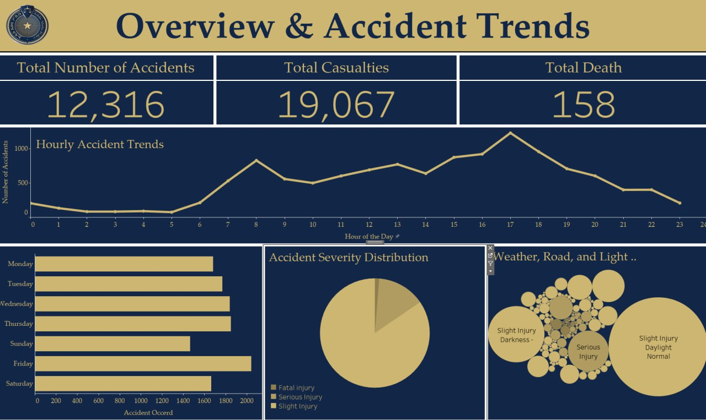

# accident-analysis-addis_ababa
This is Python based Exploratory Data Analysis(Data Visualization and Exploration) on "RTA_Dataset_addis_ababa_subcity" dataset to find out and visualize different trends


#### Language and Libraries
<p>
<a></a>
<a></a>
<a></a>
<a></a>
<a></a>
</p>

## About Dataset
**RTA_Dataset_addis_ababa_subcity**
### Description
This data set is collected from Addis Ababa Sub city police departments for Master's research work. The data set has been prepared from manual records of road traffic accident of the year 2017-20. All the sensitive information has been excluded during data encoding and finally, it has 32 features and 12316 instances of the accident


### Content
Here is the definition of the features listed, based on their names and example values:

1. **time**: The time of the incident, recorded in HH:MM:SS format.
2. **day_of_week**: The day of the week on which the event occurred.
3. **driver_age**: The age group of the driver, categorized into ranges such as '18-30', '31-50', etc.
4. **driver_sex**: The gender of the driver ('Male', 'Female', or 'Unknown').
5. **educational_level**: The highest educational qualification of the driver.
<details>

  <summary>Click to see more ...</summary>

6. **vehicle_driver_relation**: The relationship between the vehicle owner and the driver (e.g., 'Owner', 'Employee', 'Other').
7. **driving_experience**: The driver's experience level, categorized by years or specific conditions like 'No Licence'.
8. **vehicle_type**: The type of vehicle involved in the incident (e.g., 'Automobile', 'Taxi', 'Motorcycle').
9. **vehicle_owner**: The owner of the vehicle, such as 'Owner', 'Governmental', or 'Organization'.
10. **service_year**: The service duration of the vehicle, categorized by years.
11. **vehicle_defect**: Whether the vehicle had a defect at the time of the accident (e.g., 'No defect', '7', '5').
12. **accident_area**: The type of area where the accident occurred (e.g., 'Residential areas', 'Office areas').
13. **lanes**: The type of road lanes where the accident occurred (e.g., 'Undivided Two way', 'One way').
14. **road_allignment**: The road's alignment, describing its geometry (e.g., 'Tangent road with flat terrain').
15. **junction_type**: The type of road junction at the accident location (e.g., 'T Shape', 'Crossing').
16. **surface_type**: The type of road surface (e.g., 'Asphalt roads', 'Gravel roads').
17. **road_surface_conditions**: The condition of the road surface during the accident (e.g., 'Dry', 'Wet or damp').
18. **light_condition**: The lighting condition at the time of the accident (e.g., 'Daylight', 'Darkness - no lighting').
19. **weather_condition**: The weather condition at the time of the accident (e.g., 'Normal', 'Raining').
20. **collision_type**: The type of collision that occurred (e.g., 'Vehicle with vehicle collision', 'Collision with pedestrians').
21. **vehicles_involved**: The number of vehicles involved in the accident.
22. **casualties**: The number of individuals injured or killed in the accident.
23. **vehicle_movement**: The movement status of the vehicle at the time of the accident (e.g., 'Going straight', 'Parked').
24. **casualty_class**: The role of the casualty in the accident (e.g., 'Driver or rider', 'Pedestrian').
25. **casualty_sex**: The gender of the casualty.
26. **casualty_age**: The age or age group of the casualty.
27. **casualty_severity**: The severity of the casualty's injury ('1', '2', '3', or 'na').
28. **casualty_work**: The employment status or occupation of the casualty.
29. **casualty_fitness**: The fitness or health condition of the casualty (e.g., 'Normal', 'Deaf').
30. **pedestrian_movement**: The movement or behavior of the pedestrian at the time of the accident.
31. **accident_cause**: The primary cause of the accident (e.g., 'Overspeed', 'Drunk driving').
32. **accident_severity**: The severity of the accident's outcome ('Slight Injury', 'Serious Injury', 'Fatal injury').
</details>

### Installation

1. **Clone the Repository**:

   ```bash
   git clone https://github.com/Teshager21/accident-analysis-addis_ababa.git
   cd accident-analysis-addis_ababa
   ```


2. **Install Dependencies**:

   ```bash
   pip install -r requirements.txt
   ```

### Applications of Dataset
RTA_Dataset_addis_ababa_subcity can be used for numerous applications such as real-time accident prediction, studying accident hotspot locations, casualty analysis and extracting cause and effect rules to predict accidents, or studying the impact of precipitation or other environmental stimuli on accident occurrence.
## Authors

👤 **Author**

- Gmail: [Teshager Admasu](mailto:teshager8922@gmail.com)
- Github: [@teshager21](https://github.com/teshager21)
- Twitter: [@Teshage84907805](https://twitter.com/Teshage84907805)
- Linkedin: [Teshager Admasu](https://www.linkedin.com/in/teshager-admasu-0000011a2/)

👤 **Author**

- Gmail: [Natnael Chala](natnaelchala@gmail.com)
- Github: [@natiichala](https://github.com/natiichala)
- Linkedin: [Natnael Chala](https://www.linkedin.com/in/natnael-chala/)

👤 **Author**
- Gmail: [Rediet Tenaw](rediettenaw28@gmail.com)
- Github: [@RuthAlemu](https://github.com/RuthAlemu)

## 🤝 Contributing

    Contributions, issues and feature requests are welcome!

Feel free to check the [issues page](https://github.com/Teshager21/accident-analysis-addis_ababa/issues).

## Show your support

Give a ⭐️ if you like this project!
